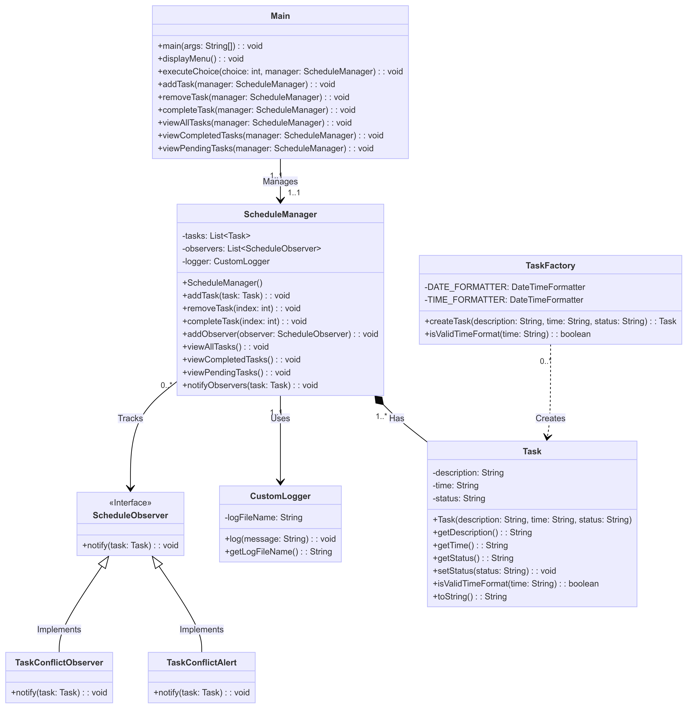
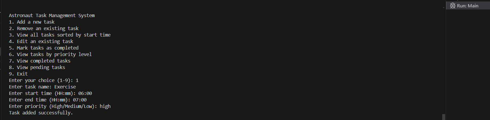
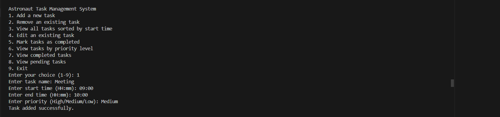
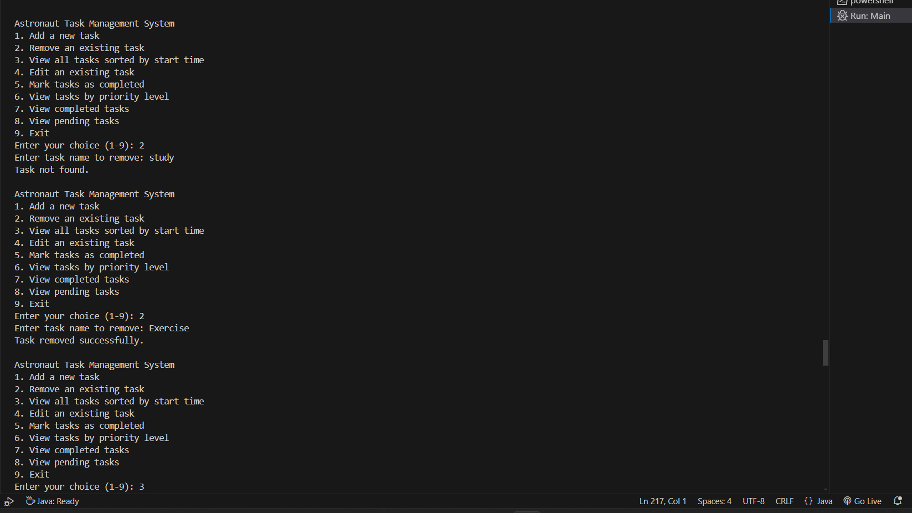
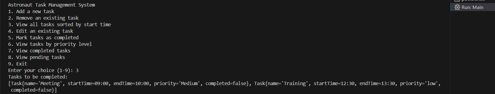

# 🚀 Astronaut Task Management System

Welcome to the Astronaut Task Management System! This console-based application efficiently manages tasks for astronauts during their missions. It includes features for task creation, scheduling, conflict detection, and reporting.

## 🎯 Features

- **Task Creation:** Create and manage tasks with specific deadlines and descriptions.
- **Task Scheduling:** Schedule tasks with accurate start and end times.
- **Conflict Detection:** Automatically detect and alert conflicts between tasks.
- **Observer Pattern:** Implement observers to monitor task changes and conflicts.
- **Logging:** Log actions performed within the application for audit purposes.
- **Task Status Tracking:** View completed and pending tasks.
- **User Interaction:** Console-based interaction for task management.



## 🛠️ Technologies Used

- **Programming Language:** Java
- **Design Patterns:** Singleton Pattern, Observer Pattern, Factory Pattern
- **Logging:** Custom Logger
- **Version Control:** Git

## 📋 Prerequisites

Before you begin, ensure you have the following installed:

- [Java Development Kit (JDK)](https://www.oracle.com/java/technologies/javase-downloads.html)
- [Git](https://git-scm.com/)

## 🚀 Installation

1. **Clone the Repository**
   ```bash
   git clone [https://github.com/Pathu564/Task_Management_System.git]
   cd astronaut_task_managementsystem
   ```

2. **Compile the Project**
   ```bash
   cd src
   javac *.java
   ```

3. **Run the Application**
   ```bash
   java Main
   ```

## 📚 Modules Description

1. **Task Management**
   - Create Task: Add new tasks with descriptions and deadlines.
   - Delete Task: Remove tasks from the schedule.
   - Update Task: Edit existing task details.

2. **Task Scheduling**
   - Set Start and End Times: Schedule tasks with specific timings.
   - Conflict Detection: Detect and alert overlapping tasks automatically.

3. **Observer Pattern**
   - Register Observers: Implement observers to monitor task changes.
   - Notify Observers: Notify observers of any changes or conflicts.

4. **Logging**
   - Action Logging: Log actions such as task creation, updates, and deletions.
   - Custom Logger: Implement a custom logging solution for the application.

5. **Task Status Tracking**
   - View Completed Tasks: Display tasks marked as completed.
   - View Pending Tasks: Display tasks that are still pending.

## 🛡️ Design Patterns

This project incorporates several design patterns to ensure a scalable and maintainable codebase:

- **Singleton Pattern:** Ensures a single instance of the Schedule Manager for consistent task management.
- **Observer Pattern:** Used for conflict detection and task status updates.
- **Factory Pattern:** Simplifies task creation and management.

## 📈 Usage Instructions

Once the application is running, follow the console prompts to:

1. **Add a Task:** Input task details and schedule it.
2. **View Tasks:** See a list of all tasks sorted based on start time.
3. **Update Tasks:** Modify task details as needed.
4. **Delete Tasks:** Remove tasks from the list.
5. **Check Conflicts:** Automatically check for any task overlaps.
6. **Mark as Completed:** Mark task as Completed.
7. **View Task Status:** See completed and pending tasks.

## Add new Task






Task Conflict :


Tima invalid:


## Remove Existing Task

Checks both cases 



## View Tasks sorted by Start time



## Edit existing Task

Negative Case


## Mark as Completed, View Completed and Pending Tasks


---

## 📞 Contact

For any questions or support, please contact:

- **GitHub:** [Pathu564](https://github.com/Pathu564)
- **Email:** [rpadmavathi2004@gmail.com](mailto:rpadmavathi2004@gmail.com)

---

